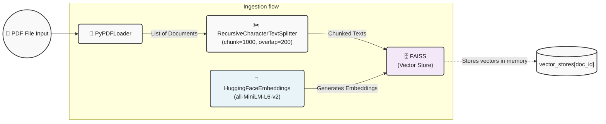
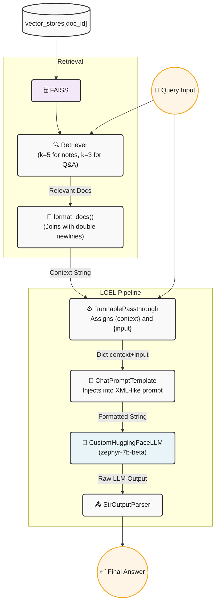

# PaperLens Pipeline Flows

Here is an architectural visualization of how your currently existing pipeline in `rag_pipeline.py` works. This follows a "Flowise-like" node architecture where different LangChain components interact with one another.

No changes have been made to your project's code.

---

## 1. Document Ingestion Pipeline

When you upload a PDF (calling `process_pdf`), the document passes through a series of steps to be chunked and indexed into the local FAISS vector store.

---

## 2. Runtime & Generation Pipeline

When you ask a question or request structured analysis (calling `answer_query` or `generate_notes`), the system retrieves the respective vector store, pulls the relevant context, and passes it through an LCEL (LangChain Expression Language) chain to the language model.

### Key Differences in your logic:
* **Generation**: During generation (`generate_notes`), it iterates over a predefined list of sections (like "Methodology", "Dataset") and runs this pipeline individually for every section.
* **Retrieval (`k` size)**: It pulls `k=5` snippets to extract more detailed content for notes, while finding quicker context (`k=3`) for direct query answering.
